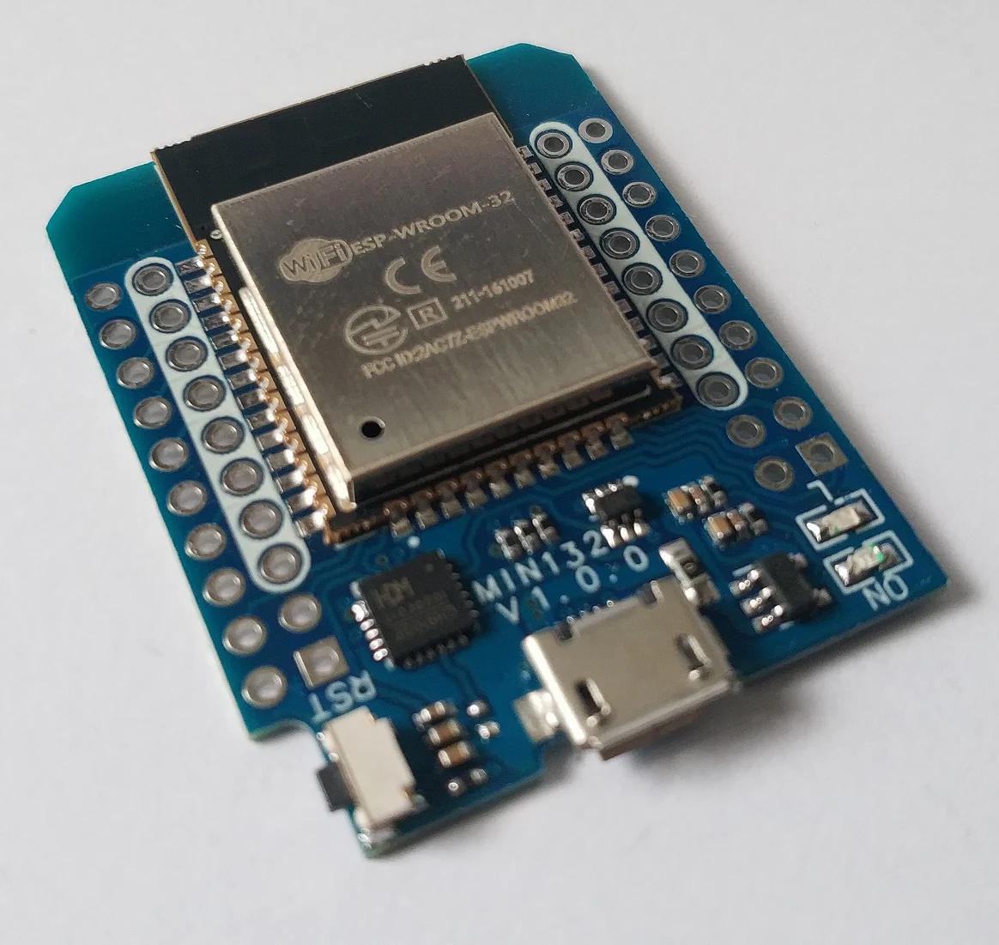
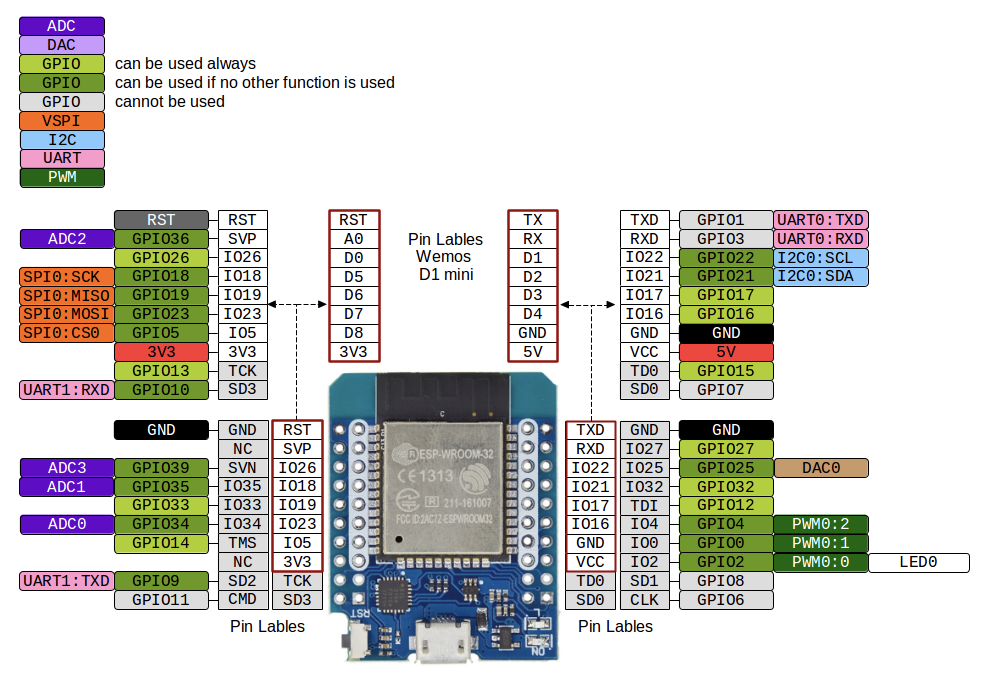
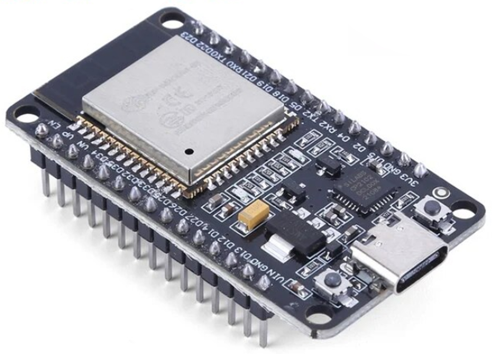
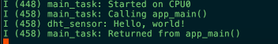
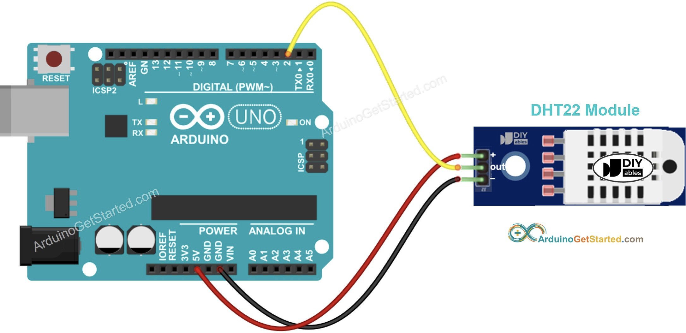

# rust-iot-workshop 🦀

In this workshop we will create a "smart" humidity and temperature sensor. The goal is to become familiar with some embedded programming in rust on ESP controllers.

## Project

todo!

## Part 0: Setup

To participate in this workshop you need three components: A esp microcontroller, a DHT sensor and a breadboard pluss wires.

#### 1. Controllers

We have two types of esp controllers to use, either the ESP32 D1 or ESP3286

<details>
<summary>ESP32 D1</summary>
 <br>



</details>

<details>
<summary>ESP3286</summary>

</details>

#### 2. DHT-22 sensor

<details>
<summary>DHT-22 sensor</summary>
 <br>
</details>

#### 3. Breadboard and wires

<details>
<summary>breadboard and wires</summary>
 <br>
</details>

#### Setup development environment

To build and upload our application onto a esp board we need to generate our project for our chip and some tooling. First we need to setup esp on our pc:

<details>
<summary> Setup esp on your computer 💻 </summary>
To be able to work with our esp controller we need to setup our development environment. Esp has a [official book](https://docs.esp-rs.org/book/introduction.html) which explains how to work with esp controllers with rust

### Prerequisites

To run application with standard library(std) we need ldproxy.

> [!TIP]
> If you have [cargo binstall](https://github.com/cargo-bins/cargo-binstall) installed, you can use `cargo binstall <program>` for the commands below to avoid having to compile the projects

```
cargo install ldproxy
```

### Setup tooling for RISC-V and Xtensa Targets

This setup is also described in the book [here](https://docs.esp-rs.org/book/installation/riscv-and-xtensa.html). So feel free to check it out for a more detail description of the tooling. Setting up the tooling is a three step process:

1. Install espup

```
cargo install espup
```

2. Install dependencies

```
espup install
```

Run:

```
brew install cmake ninja dfu-util
```

Install `espflash` to allow flashing data to the controller:

```
cargo install cargo-espflash
```

3. Setup environment variables
   ESP uses some specific environment variables when building the project, these values need to be exported via the export script downloaded by espup. To avoid having to run this command

```
. $HOME/export-esp.sh
```

each time we need change project I recommend adding a alias to your rc file. By adding this line to our rc file

```
alias get_idf='. $HOME/export-esp.sh'
```

we can run `get_idf` befor building a different esp project. Remember to source the shell after updating your rc file.

</details>
<br>

Once esp is setup on our computer we can try to build and run the project on our controller. I have created a template project called `dht-sensor`, run `cd dht-sensor` to move into the project and run it using: <br >

```
cargo run
```

(If you get a choice between tty and cu, choose tty)

If everything worked, you should get the following output:

<details>
<summary> Output:</summary>
 <br>
</details>

_If you got stuck at "Connecting...", hit the reset-button on the controller_

## Part 1: Getting data from the sensor (using lib)

-The first challenge is to create a program that reads sensor values at an interval. The first ting we need to so is
-The first thing we need to do wire our sensor and controller on the breadboard correctly. Once that is done we can driver

- +The first challenge is to create a program that reads sensor values at an interval. The first ting we need to so is
  +The first thing we need to do wire our sensor and controller on the breadboard correctly. Once that is done we can driver
  +++++++ Contents of side #2

The first challenge is to create a program that reads sensor values at an interval.
The first thing we need to do is wire our sensor and controller correctly.

> [!TIP] > 
> Check out [Arduino's tutorial](https://arduinogetstarted.com/tutorials/arduino-dht22) for details.

### Pinout diagram

Choose any GPIO pin you want, e.g. 4:


### Reading from the sensor

Try checking out the [documentation for the DHT22-sensor](https://docs.rs/embedded-dht-rs/0.5.0/embedded_dht_rs/). See what they do and use for the DHT22-sensor.

#### PinDriver

This is confusing, so let's go through it together.

We need to tell the controller which pins we are using and how (which state). We are going to _read_ data from the pin, but we also need to tell the sensor when to read, so we need a pin we can input and output to/from.

```rust
let pin = PinDriver::input_output_od(peripherals.pins.gpio4).unwrap();
```

#### Now create and read from the sensor, just log the output

_NB_ The sensor might not give out data, so be gentle, allow it to error and try to read more than once if it fails.
Set the delay to 1000us.

<details>
<summary>Solution 💡</summary>

```rust
use std::{thread::sleep, time::Duration};

use embedded_dht_rs::dht22::Dht22;
use esp_idf_svc::hal::{delay::Delay, gpio::PinDriver, prelude::Peripherals};

fn main() {
    // It is necessary to call this function once. Otherwise some patches to the runtime
    // implemented by esp-idf-sys might not link properly. See https://github.com/esp-rs/esp-idf-template/issues/71
    esp_idf_svc::sys::link_patches();

    // Bind the log crate to the ESP Logging facilities
    esp_idf_svc::log::EspLogger::initialize_default();

    let peripherals = Peripherals::take().unwrap();

    let delay = Delay::new(1000);

    let pin = PinDriver::input_output_od(peripherals.pins.gpio4).unwrap();

    let mut sensor = Dht22::new(pin, delay);

    loop {
        match sensor.read() {
            Ok(reading) => {
                println!("{}°C, {}% RH", reading.temperature, reading.humidity)
            }
            Err(e) => eprintln!("Error: {:?}", e),
        }

        sleep(Duration::from_secs(1));
    }
}
```

</details>

## Part 2: Creating our own "smart" sensor

Now that we have a working DHT sensor, we can start creating our smart sensor. The general idea is to be able to access our sensor data via internet. The first step towards this is to create our own struct that receives a GPIO pin and creates a DHT instance and exposes a `read`-method.

To start, create a new module [`sensor`](./dht-sensor/sensor.rs).
This module will house our logic for reading data from the sensor itself.

Create a struct `SmartSensor` with a `new`-method and a `read`-method. The `read`-method should return the sensor data.

<details> 
<summary> Solution💡</summary>

```rust
//dht_sensor/sensor.rs
use embedded_dht_rs::{dht22::Dht22, SensorError, SensorReading};
use embedded_hal::{
    delay::DelayNs,
    digital::{InputPin, OutputPin},
};

pub struct SmartSensor<P: InputPin + OutputPin, D: DelayNs> {
    sensor: Dht22<P, D>,
}

impl<P: InputPin + OutputPin, D: DelayNs> SmartSensor<P, D> {
    pub fn new(pin: P, delay: D) -> Self {
        Self {
            sensor: Dht22::new(pin, delay),
        }
    }

    pub fn read(&mut self) -> Result<SensorReading<f32>, SensorError> {
        self.sensor.read()
    }
}
```

Then main has a simple update like so:

```rust
let mut sensor = SmartSensor::new(pin, delay);
```

</details>

## Part 3: Running our web server

Now that we have created our smart sensor package we can start making it "smart". The next step is to make our smart sensor run a http server that we can reach from our computer. Lets create a `run` method that starts a server with a simple alive endpoint on `/alive`.

But first, we need to connect to Wi-Fi. You should use a personal hotspot from your mobile phone and connect _both_ your computer and the controller to the same network. This way we will be able to communicate through that network to/and from our controller. We've created a Wi-Fi module to make it simpler to connect to a network, so you just need to fill in the SSID and password, and add the `wifi::connect()`-call to the `main`-function. Fill inn the SSID and password in the config in [config.rs](./dht-sensor/src/config.rs).
Use this snippet to make it work:

```rust
let sysloop = EspSystemEventLoop::take()?;

println!("{:?}: {:?}", APP_CONFIG.wifi_ssid, APP_CONFIG.wifi_ssid);

let _wifi = match connect(
    APP_CONFIG.wifi_ssid,
    APP_CONFIG.wifi_pwd,
    peripherals.modem,
    sysloop,
) {
    Ok(inner) => {
        println!("Connected to Wi-Fi network!");
        inner
    }
    Err(err) => {
        // Red!
        bail!("Could not connect to Wi-Fi network: {:?}", err)
    }
};
```

<details> 
<summary>Solution💡 </summary>

```rust
use embedded_dht_rs::{dht22::Dht22, SensorError, SensorReading};
use embedded_hal::{
    delay::DelayNs,
    digital::{InputPin, OutputPin},
};
use esp_idf_svc::{
    http::{
        server::{Configuration, EspHttpServer},
        Method,
    },
    io::{EspIOError, Write},
};
use std::{thread::sleep, time::Duration};

pub struct SmartSensor<P: InputPin + OutputPin, D: DelayNs> {
    sensor: Dht22<P, D>,
}

impl<P: InputPin + OutputPin, D: DelayNs> SmartSensor<P, D> {
    pub fn new(pin: P, delay: D) -> Self {
        Self {
            sensor: Dht22::new(pin, delay),
        }
    }

    pub fn run(&mut self, port: u16) -> Result<(), EspIOError> {
        let conf = Configuration {
            http_port: port,
            ..Default::default()
        };
        let mut server = EspHttpServer::new(&conf)?;
        server.fn_handler(
            "/alive",
            Method::Get,
            |request| -> core::result::Result<(), EspIOError> {
                let mut response = request.into_ok_response()?;
                let res_text = "alive";
                response.write_all(res_text.as_bytes())?;
                Ok(())
            },
        )?;

        println!("running server");

        loop {
            sleep(Duration::from_secs(1));
        }

        Ok(())
    }

    pub fn read(&mut self) -> Result<SensorReading<f32>, SensorError> {
        self.sensor.read()
    }
}
```

</details>

## Part 4: Get measurements from server

## Part 5: (Optional) Measurements SSE?
